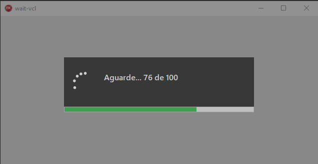

# Form to wait for VCL projects (Delphi)


This component allows you to create forms of wait with progress bar (optional) in a simple way.

### Prerequisites
 * [**Boss**](https://github.com/HashLoad/boss) - Dependency Manager for Delphi
 * [**BlockUI-VCL**](https://github.com/viniciussanchez/blockui-vcl) - Block User Interface for VCL Projects (Delphi)
 
### Installation 
```
boss install github.com/viniciussanchez/wait-vcl
```

### Getting Started
You need to use VCL.Wait.Intf and VCL.Wait
```
uses VCL.Wait.Intf, VCL.Wait;
```

#### Form with progress bar
```
var
  I: Integer;
  Waiting: IWait;
begin
  Waiting := TWait.Create('Exemplifying the wait screen', Self);
  Waiting.ShowProgressBar(True);
  Waiting.ProgressBar.SetMax(100);
  Waiting.ProgressBar.SetPosition(0);
  for I := 1 to 100 do
  begin
    Sleep(50);
    Waiting.ProgressBar.Step;
  end;
end;
``` 


**Self** refers to the component that will be blocked until the end. The default is Application.MainForm.

```
Waiting := TWait.Create('Exemplifying the wait screen', Self);
Waiting := TWait.Create('Exemplifying the wait screen', FrmSample);
Waiting := TWait.Create('Exemplifying the wait screen');
``` 

You can increment more than one:

```
for I := 1 to 50 do
begin
  Sleep(50);
  Waiting.ProgressBar.Step(2);
end;
``` 

#### Form without progress bar
```
var
  Waiting: IWait;
begin
  Waiting := TWait.Create('Exemplifying the wait screen');
  Sleep(3000); // Your code...
end;
```

