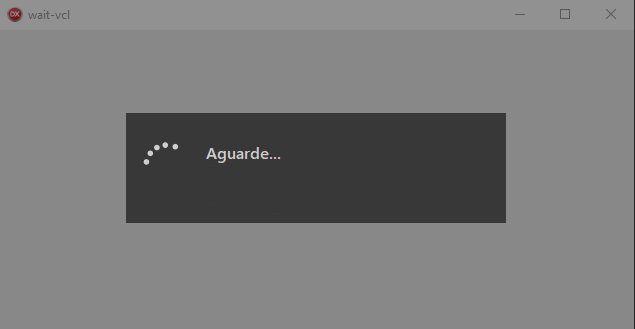

# Form to wait for VCL projects (Delphi)


This component allows you to create forms of wait with progress bar (optional) in a simple way.

### Prerequisites
 * [**Boss**](https://github.com/HashLoad/boss) - Dependency Manager for Delphi
 * [**BlockUI-VCL**](https://github.com/viniciussanchez/blockui-vcl) - Block User Interface for VCL Projects (Delphi)
 
### Installation 
```
boss install github.com/viniciussanchez/wait-vcl
```

### Getting Started
You need to use VCL.Wait
```
uses VCL.Wait;
```

#### Form with progress bar
```
var
  Waiting: TWait;
begin
  Waiting := TWait.Create.SetContent('Aguarde...').Start(
    procedure
    var
      I: Integer;
    begin
      Waiting.ProgressBar.Show;
      Waiting.ProgressBar.SetMax(100);
      for I := 1 to 100 do
      begin
        Waiting.SetContent('Aguarde... ' + I.ToString + ' de 100');
        Waiting.ProgressBar.Step();
        Sleep(100); // Your code here!!!        
      end;
    end);
end;
``` 


You can increment more than one:

```
Waiting.ProgressBar.Step(2);
``` 

#### Form without progress bar
```
begin
  TWait.Create.SetContent('Aguarde...').Start(
    procedure
    begin
      Sleep(1500); // Your code here!!!
    end);
end;
```

